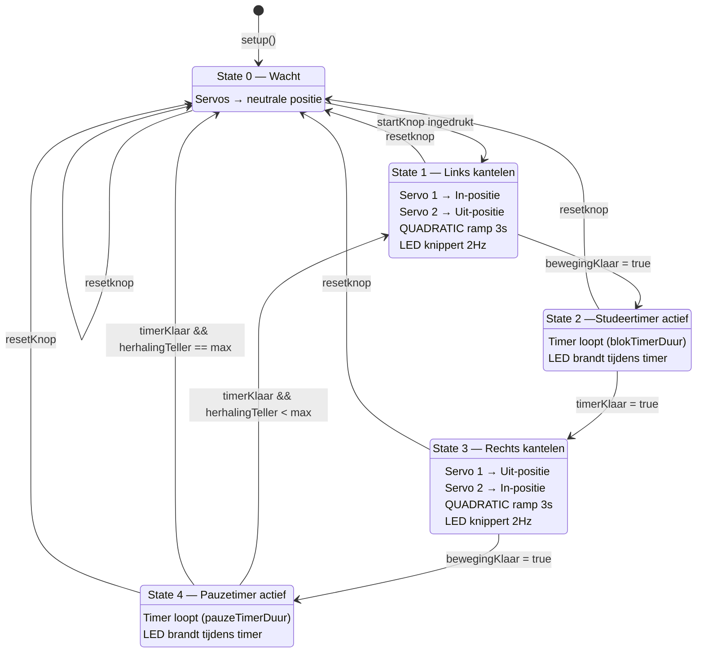
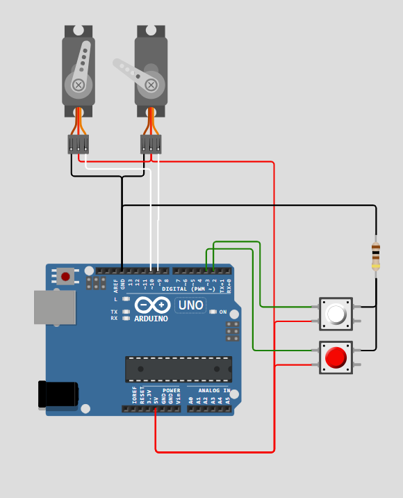

# Pommeldoro

Deze code combineert de timer en de servo test tot een werkend prototype.

**Functie:**
Wanneer de Arduino opstart, gaat het systeem in wachtstatus. De servo's bewegen naar 
hun neutrale positie en wachten op invoer.

Bij het indrukken van de startknop wordt een positieve flankdetectie uitgevoerd en 
start de timercyclus. Elke cyclus verloopt als volgt:

1. De servo's kantelen naar de studeerstand.
2. De studeer-timer loopt af.
3. De servo's kantelen naar de pauzestand.
4. De pauze-timer loopt af.

Deze cyclus herhaalt zich tot het ingestelde aantal herhalingen bereikt is, waarna 
het systeem terugkeert naar de wachtstatus. Op elk moment kan de resetknop gebruikt 
worden om onmiddellijk terug te keren naar de wachtstatus.

De werking is geïmplementeerd als een state machine in C++, via de switch-instructie.

## Extra functie's V2
De volgende versie van de pommeldoro krijgt een IMU om de hoek van de timer te meten. Wanneer de gemeten hoek niet overeenkomt met de kanteling komt er een foutmelding. 
Ook kan de IMU gebruikt worden om de timer te starten. De wachtstate wordt dan wanneer de timer rechtop staat. Eens die plat wordt gelegd zal die naar state 1 gaan.

<video width="320" height="240" controls>
  <source src="//imgs/Pommeldoro_v1.mp4" type="video/mp4">
</video>

## Functieschema

## Schakeling

