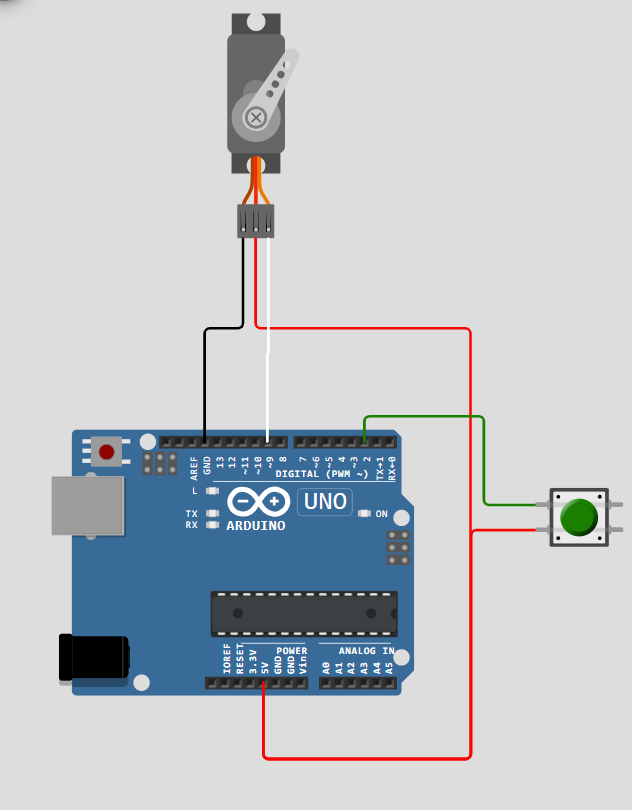
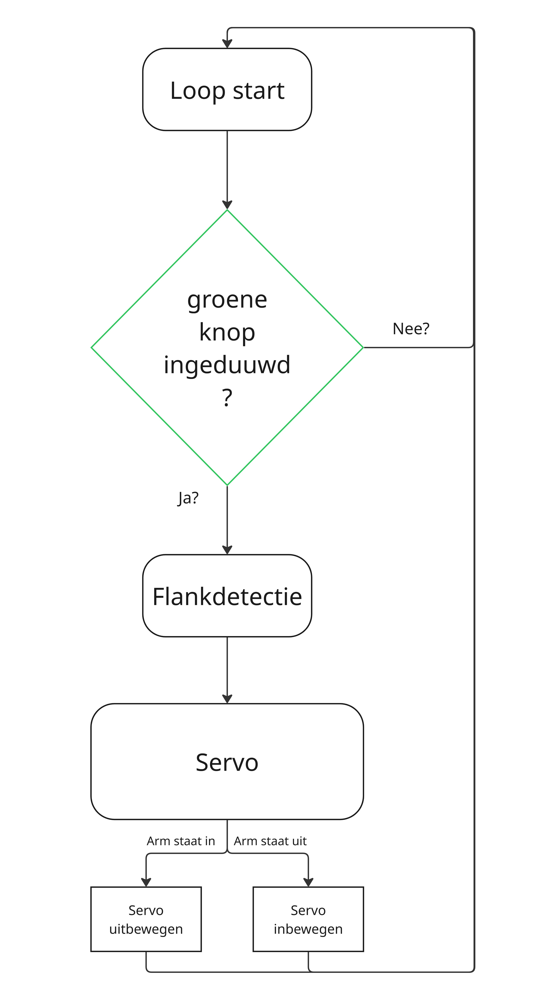

# Servo aansturingstest

Deze test heeft als doel een functie schrijven die op commanodo de arm van uitgestrekte naar ingeplooide toestand kan verplaatsen volgens een gecontroleerd pad. Er wordt gewerkt met een duuwknop om de trigger te initiëren.

**In deze code werden volgende librarys gebruikt:**
- Servo library[^1]
- Ramp library[^2]
[^1]:https://github.com/arduino-libraries/servo
[^2]:https://github.com/siteswapjuggler/RAMP

 ## Schakeling

 ## Blokschema

